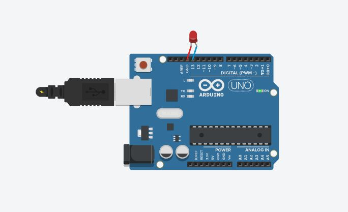

# BLINKING LED
***

## Introduction
Project Name: Blinking LED
Introduction
This project is a simple demonstration of how to use an Arduino board to blink an LED light. It is a basic project that can be used to learn the basics of programming with an Arduino.

## Body
The project uses a built-in LED light on the Arduino board connected to Pin 13. The code initializes the LED as an output and uses a loop to turn the LED on for one second and then off for another second repeatedly.

### How it works
The code starts by initializing the LED connected to Pin 13 as an output using the pinMode() function. The setup() function is called once at the beginning to set up the board. The loop() function then executes repeatedly, turning the LED on using the digitalWrite() function and setting the voltage level to HIGH. It then waits for one second using the delay() function before turning the LED off by setting the voltage level to LOW using the digitalWrite() function again. It waits for another second before repeating the process.
## Screenshot

## Conclusion
This project is a great starting point for anyone who wants to learn how to program with an Arduino. It is a simple demonstration of how to control an output pin on the board and can be expanded upon to control other electronic components.
## Author
[Titus Kiplagat](https://www.linkedin.com/in/titus-kiplagat-5146ba210/)